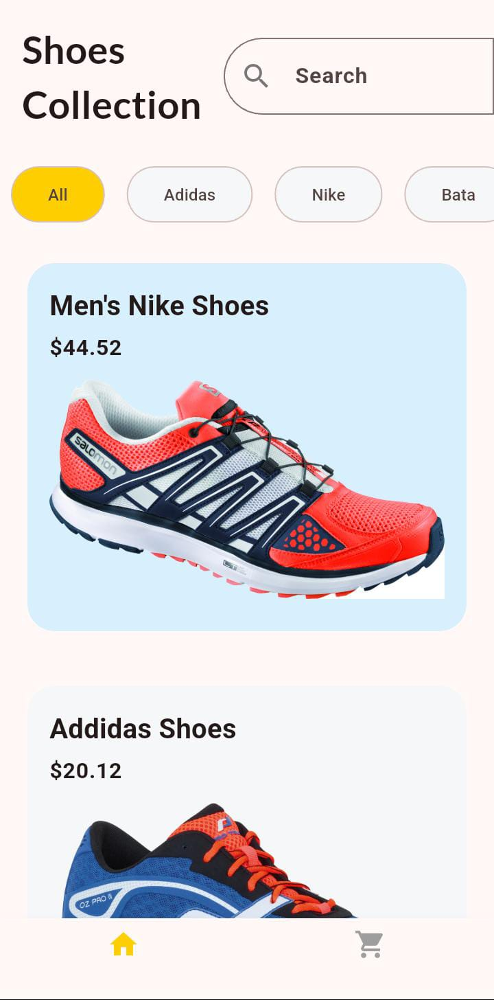
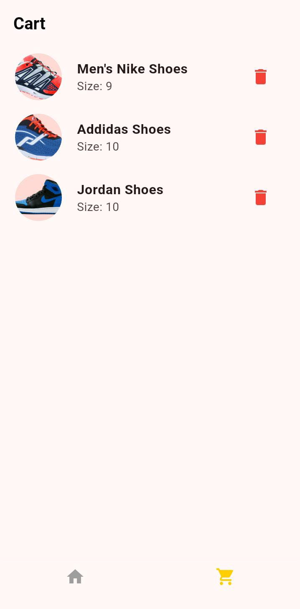
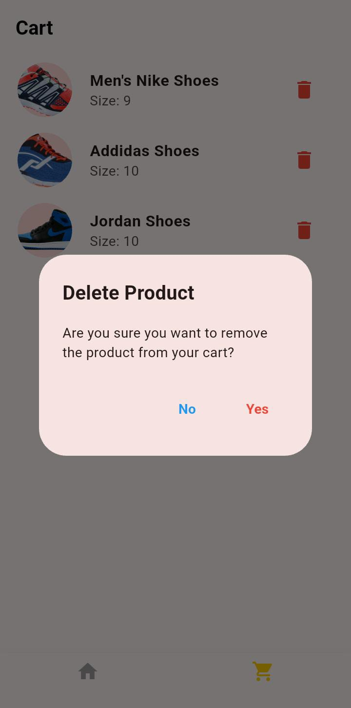

# 🛒 Basic E-Commerce Flutter App

A simple yet functional **Flutter e-commerce demo app** where users can browse products, filter them, add items to the cart, and manage cart items.  
Built with **Provider** for state management and a clean UI inspired by modern shopping apps.

---

## ✨ Features

- 🔍 **Product Listing** with filtering options (brand, size, etc.)  
- 🛍 **Product Details Page** with images and available sizes  
- 🛒 **Cart Page** with add/remove functionality  
- 🎨 Custom **theme & colors** for a consistent look  
- 📱 **Bottom Navigation Bar** with Home & Cart tabs  
- ⚡ State management with **Provider package**

---

## 📸 Screenshot

## 🛠️ Tech Stack

- [Flutter](https://flutter.dev/) (UI framework)  
- [Dart](https://dart.dev/) (language)  
- [Provider](https://pub.dev/packages/provider) (state management)  
- [Google Fonts](https://pub.dev/packages/google_fonts) (typography)  
