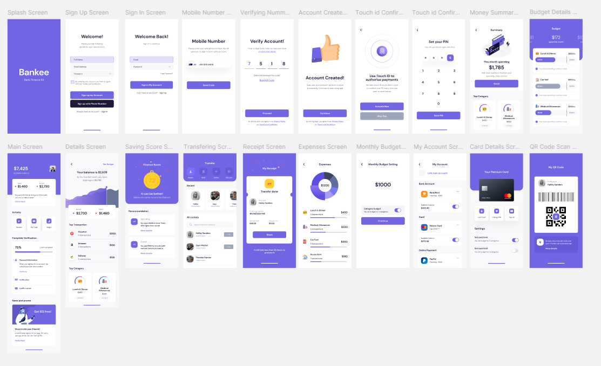

# 💳 Bankee – Modern Banking App UI

Bankee is a **Flutter-based mobile banking application UI** built to showcase clean layouts, smooth animations, and scalable component design.  
This project focuses on creating a **complex, real-world banking interface** with a dashboard, transactions, verification steps, and promotions.

---

## 🚀 Features

- 📊 **Dashboard Screen**
  - Balance overview
  - Spending & earning summary cards
  - Insights and tips section

- 🛠 **Activity Section**
  - Quick actions: Transfer, My Card, Insight
  - Clean, card-based design

- ✅ **Verification Flow**
  - Progress indicator (e.g., 75% complete)
  - Step-by-step verification checklist
  - Interactive buttons for completing actions

- 📢 **Promotions & News**
  - Attractive card design for offers
  - Illustration-based promo banners

- 🎨 **UI/UX**
  - Gradient headers
  - Rounded cards with shadows
  - Consistent typography
  - Light & modern banking style

---

## 📱 Screenshots

---

## 🛠 Tech Stack

- **Framework**: Flutter 3.x
- **Language**: Dart
- **State Management**: Provider (or setState for simplicity)
- **UI Components**: Custom reusable widgets
- **Design Tools**: Figma / Dribbble UI references

---

## 📂 Project Structure

