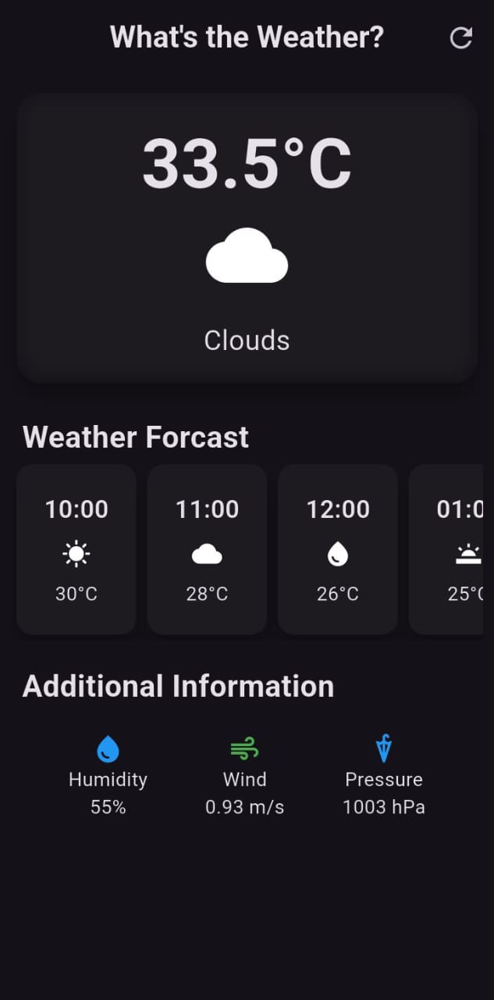

# Flutter Playground 🎠

Welcome to my **Flutter Playground** — a collection of practice apps, experiments, and mini-projects I built while learning Flutter.  
This repo is my hands-on journey through Flutter basics, UI design, state management, and more.  

---

## 📌 What's inside?
Some of the things you’ll find here:
- 🛒 **Basic Ecommerce App** – product listing, cart, Provider state management
- 🎨 **UI Experiments** – custom theming, fonts, borders, layouts
- 🧩 **Widgets Practice** – ListView, BottomNavigationBar, Chips, TextFields, etc.
- ⚡ **State Management** – Provider examples (adding/removing from cart, etc.)
- 🧪 **Other experiments** – trying out Flutter internals and fun ideas

---

## 🚀 Why this repo?
- A place to keep all my Flutter practice projects in one place  
- To track my progress as I explore **Flutter & Dart**  
- Maybe helpful for others starting their Flutter journey too ✨  

---

## 🛠️ Tech Stack
- **Flutter** (UI toolkit)  
- **Dart** (programming language)  
- Provider (state management)  
- Material Design  

---

## 📷 Screenshots

- Basic Weather App


- Basic Ecommerence App


---

## 📚 How to Run
1. Clone this repo  
   ```bash
   git clone https://github.com/Smeedsajjad/flutter-playground.git
